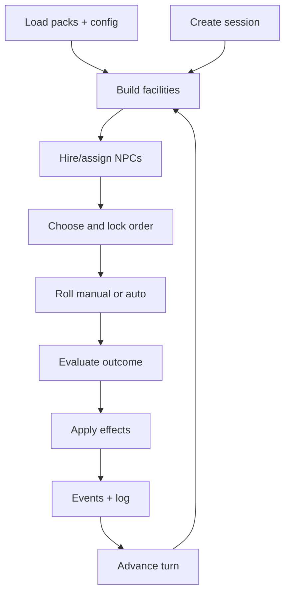
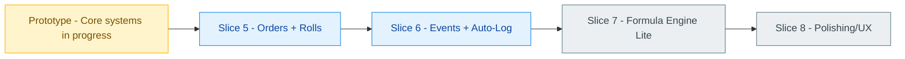

# DnD Bastion Manager

## One-liner
A data-driven DM tool for bastions: build, run, roll, log.

## Short Description
The Bastion Manager guides the DM through session setup, build phase, and the weekly turn cycle.
Core loop: build facilities, assign NPCs, lock orders, resolve rolls, apply effects, log events, advance turn.
Differentiator: not an idle bastion, but decision-driven play with narrative hooks that stays cleanly automatable.

## Plug-and-Play Packs (JSON Only)
Packs are pure JSON and designed for drop-in customization, no code changes required.
Add or edit files in `custom_packs` to extend facilities, orders, stats, events, and mechanics.
This keeps content modular and reviewable, and makes it easy to merge curated packs into core later.

## What Makes It Special
- Plug-and-play: packs can be customized purely via JSON, no code required.
- Decision-driven instead of passive income: every facility has orders with clear consequences.
- Bastion as a real place with autonomous NPCs, story hooks, and events.
- Data-driven packs and custom mechanics (stats, events, formula engine) without code changes.
- DM-first flow: manual rolls or auto-roll, transparent logs and ledger.

## Highlights
- Session wizard with bastion metadata and player registry.
- Facility catalog and build queue with upgrades and build times.
- NPC hiring, assignment, leveling, and upkeep tracking.
- Order flow with lock, duration, and check-profile-based rolls.
- Ledger for currency, items, and custom stats plus audit log.
- Pack validation, event tables, and optional formula engine (pub).

## Systems At A Glance

## Status
Status: Prototype in active development.

## Docs
- [Bastion System Concept](docs/concepts/bastion.md)
- [UI Concept](docs/concepts/ui_concept.md)
- [Facility How-To](docs/concepts/facility_how_to.md)
- [Development Plan](docs/concepts/bastion_manager_Development_plan.md)
- [Development Slices](docs/concepts/DEVELOPMENT_SLICES.md)

## License
Use, forks, and reuse are allowed with attribution (e.g., in README/docs or credits).
Contributions and modular extensions are explicitly welcome; after review they can be merged into core.
